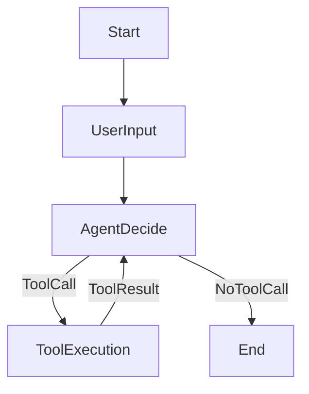

(この設計書はAIが生成しています)
本基本設計書は、LangChainフレームワークを活用した対話型AI CLIツールの開発における全体アーキテクチャ、主要コンポーネント、および技術選定の指針を定めることを目的とする。特に、`think_tool`を用いた思考と自己批判によるハルシネーション対策、LLM設定の柔軟性、および会話履歴の効率的な管理に焦点を当てる。

## 2. 全体アーキテクチャ

本CLI AIは、`src/main.py`をエントリーポイントとし、ユーザーからの自然言語による指示を受け取り、LangChainエージェントがその指示を解釈し、適切なツール（インターネット検索、フォルダ・ファイル操作、コマンド実行など）を呼び出してタスクを実行する。エージェントは`think_tool`を用いた思考と自己批判により、自身の思考プロセスと最終的な応答の品質を評価し、問題が発生した場合は自律的に解決策を検討し、必要に応じてユーザーに対応の実行許諾を得る。最終的な応答はユーザーに自然言語でフィードバックされる。こうした会話を続けていくことができる。

## 3. 主要コンポーネント設計

### 3.1 CLIインターフェース
- **フレームワーク**: `Typer` を使用。
- **機能**: ユーザーからのコマンドライン引数としてリクエストを受け付け、エージェントからの応答を整形して表示する。

### 3.2 メインAIエージェント
- **フレームワーク**: `LangChain` を使用。
- **エージェントタイプ**: `LangGraph` を用いたステートマシンベースのエージェントを構築する。`src/core/agent.py`で定義された`main_agent_graph`が、コンパイルされたLangGraphアプリケーションとして、複雑な思考プロセス、ツール呼び出しを柔軟に制御する。
- **プロンプト設計**: プロジェクト計画書「2.2 プロンプト設計方針」に従い、すべてのプロンプトは日本語で記述し、`<前提>`, `<指示>`, `<入力>` などのXMLタグで構造化する。`think_tool`は、エージェントの戦略的思考、作業過程の記録、および最終回答の自己評価のために使用される。
- **メモリ**: 会話履歴を保持し、コンテキストを維持するために、`src/core/agent.py` の `run_agent` 関数内で `chat_history` を管理する。
    - **ツールメッセージの扱い**: ツール実行結果は、`ToolMessage`として直接 `chat_history` に追加される。
    - **会話履歴の要約**: `src/config.py` で設定された `MAX_CONVERSATION_TURNS` を超える会話履歴は、LLMによって要約される。要約後、最新の `SUMMARY_CONVERSATION_TURNS` 分の会話と要約メッセージが `chat_history` に保持される。`MAX_CONVERSATION_TURNS` が `0` の場合は要約を行わない。
        - **要約境界の調整**: `AIMessage` (ツール呼び出し) とそれに続く `ToolMessage` (ツール結果) のペアが要約境界で分断されることを防ぐため、要約境界を動的に調整するロジックを実装済み。これにより、ツール実行のコンテキストが維持される。
    - **作業用メモリ**: `memos`フィールドは、複数ステップのタスクにおける中間調査過程や必要な情報を「作業用メモリ」として記録するために使用される。作業完了時、または不要になった情報は`memos`から削除される。

### 3.4 ツール設計
各ツールはLangChainの `Tool` クラスとして実装し、エージェントが利用できるようにする。
実行した結果をAI Agentにフィードバックする。

#### 3.4.1 エージェント思考・作業管理ツール
- **`think_tool`**:
    - **機能**: 作業の進捗、意思決定、および最終回答の品質を戦略的に振り返り、自己評価するためのツール。各思考サイクルやツール出力を得た後、または最終回答を生成する前にこのツールを使用し、結果を分析して次のステップを体系的に計画し、回答の品質を評価する。自己評価の結果、問題が見つかった場合は、回答を修正する。
    - **入力**: `reflection` (str): 作業の進捗、発見、ギャップ、次のステップについての詳細な振り返り。
    - **出力**: 意思決定のために振り返りが記録されたことの確認。
- **`work_tool`**:
    - **機能**: エージェントの作業状態、計画、課題などを管理するためのツール。エージェントの現在の作業に関する様々な情報を更新するために使用される。各パラメータは独立して更新可能で、指定された値がAgentStateに反映される。
    - **入力**: `overall_policy` (str, optional), `worker_role` (str, optional), `work_rules` (str, optional), `work_plan` (str, optional), `work_content` (str, optional), `work_purpose` (str, optional), `work_results` (str, optional), `current_issues` (str, optional), `issue_countermeasures` (str, optional), `next_steps` (str, optional), `memos` (str, optional), `todo_list` (list[dict], optional)
    - **出力**: 更新された作業状態の辞書。AgentStateにマージされる。

#### 3.4.2 インターネット検索ツール
- **機能**: ユーザーの質問やエージェントの思考プロセスに必要な情報をインターネットから検索し、結果の要約または関連スニペットを返す。特に、最新の情報や特定のウェブサイトからの情報を取得するのに役立つ。
- **実装**: `Tavily` や `Google Custom Search API` のLangChainラッパーを検討。
- **入力**: `query` (str): 検索クエリ（文字列）
- **出力**: 検索結果の要約または関連スニペット（文字列）。検索結果がない場合は、その旨を伝える。

#### 3.4.3 Webコンテンツ取得ツール
- **機能**: 指定されたURLのコンテンツを直接取得する。文字コードを自動判定し、テキスト形式で内容を返す。インターネット検索ツールが提供するスニペット以上の詳細な情報が必要な場合に利用される。
- **実装**: Pythonの標準ライブラリ (`urllib.request`) と文字コード自動判定ライブラリ (`chardet`) を使用。
- **入力**: `url` (str): 取得したいコンテンツのURL。
- **出力**: URLから取得したコンテンツのテキスト。エラーが発生した場合はエラーメッセージを返す。

#### 3.4.4 ファイル・ディレクトリ操作ツール
- **機能**: ローカルファイルシステムに対する一連の操作（一覧表示、作成、削除、読み書き、移動、複数ファイル読み込み、ファイル内容検索）を行うツール群。自然言語による指示を解釈し、これらのツールを組み合わせて実行する。ツール実行時のエラーは捕捉され、エージェントにフィードバックされるため、エージェントはエラー内容に基づいて自己修正を試みる。
- **実装**: Pythonの標準ライブラリ (`os`, `pathlib`, `shutil`) を使用して実装する。
    - **テキストファイルの読み込み**: 現在、ファイルの内容は `raw_bytes.decode('utf-8', errors='replace')` を使用してデコードされる。これにより、デコードエラーによるクラッシュを防ぐが、非UTF-8ファイルでは文字化けが発生する可能性がある。将来的に、より堅牢な文字コード検出と処理を導入する必要がある。

- **ツール一覧**:
    1.  **`list_directory_contents(path: str)`**: 指定されたパスのディレクトリ内容を一覧表示する。
        - **入力**: ディレクトリパス（文字列）
        - **出力**: ファイルとサブディレクトリの一覧（文字列）
    2.  **`read_file(path: str)`**: 指定されたファイルの内容を読み込む。
        - **入力**: ファイルパス（文字列）
        - **出力**: ファイルの内容（文字列）
    3.  **`write_file(path: str, content: str)`**: 指定されたファイルに内容を書き込む（上書き）。
        - **入力**: ファイルパス（文字列）、書き込む内容（文字列）
        - **出力**: 成功/失敗メッセージ
    4.  **`delete_file(path: str)`**: 指定されたファイルを削除します。
        - **入力**: ファイルパス（文字列）
        - **出力**: 成功/失敗メッセージ
    5.  **`create_directory(path: str)`**: 指定されたパスにディレクトリを新規作成する。
        - **入力**: ディレクトリパス（文字列）
        - **出力**: 成功/失敗メッセージ
    6.  **`delete_directory(path: str)`**: 指定されたディレクトリを削除します（内容物があっても削除されます）。
        - **入力**: ディレクトリパス（文字列）
        - **出力**: 成功/失敗メッセージ
    7.  **`move(source_path: str, destination_path: str)`**: ファイルまたはディレクトリを移動または名前変更する。
        - **入力**: 移動元パス（文字列）、移動先パス（文字列）
        - **出力**: 成功/失敗メッセージ
    8.  **`modify_file_content(path: str, old_text: str, new_text: str)`**: 指定されたファイルの内容を読み込み、特定の文字列を別の文字列に置換して、その内容をファイルに書き戻します。
        - **入力**: ファイルパス（文字列）、置換対象文字列（文字列）、置換後文字列（文字列）
        - **出力**: 成功/失敗メッセージ
    9.  **`read_many_files(paths: list[str], exclude: list[str] = None, include: list[str] = None, recursive: bool = True, useDefaultExcludes: bool = True)`**: 複数のファイルやディレクトリの内容を読み込みます。globパターンもサポートします。テキストファイルのみを対象とし、バイナリファイルはスキップされます。
        - **入力**: `paths` (リスト[文字列], 必須): 読み込むファイルやディレクトリのパス、またはglobパターンのリスト。`exclude` (リスト[文字列], オプション): 除外するファイルやディレクトリのglobパターン。`include` (リスト[文字列], オプション): 追加で含めるglobパターン。`recursive` (ブール値, オプション): 再帰的に検索するかどうか。`useDefaultExcludes` (ブール値, オプション): デフォルトの除外パターンを適用するかどうか。
        - **出力**: 読み込んだファイルの内容を連結した文字列。各ファイルの内容は`--- {filePath} ---`で区切られる。エラーが発生した場合は、エラーメッセージを返す。
    10. **`search_file_content(pattern: str, include: str = None, path: str = None)`**: 指定されたディレクトリ内のファイル内容から正規表現パターンを検索します。マッチした行、ファイルパス、行番号を返します。
        - **入力**: `pattern` (文字列, 必須): 検索する正規表現パターン。`include` (文字列, オプション): 検索対象ファイルをフィルタリングするglobパターン。`path` (文字列, オプション): 検索対象ディレクトリの絶対パス。
        - **出力**: マッチした行、ファイルパス、行番号を含む文字列。検索結果がない場合は、その旨を伝える。

#### 3.4.5 コマンド実行ツール
- **機能**: ユーザーやエージェントの指示に基づき、シェルコマンドを実行する。ローカルファイルの検索（`grep`, `find`など）もこのツールを通じて行う。
- **実装**: Pythonの `subprocess` モジュールを使用。
    - **コマンド出力のデコード**: 現在、コマンドの標準出力および標準エラー出力は `raw_bytes.decode('utf-8', errors='replace')` を使用してデコードされる。これにより、デコードエラーによるクラッシュを防ぐが、非UTF-8出力では文字化けが発生する可能性がある。将来的に、より堅牢な文字コード検出と処理を導入する必要がある。
- **セキュリティ**: 危険なコマンド（例: `rm -rf`）の実行を防ぐためのガードレールや確認メカニズムを導入済み。具体的には、実行前にユーザーにコマンド内容の確認を求めるプロンプトの表示や、特定の危険なコマンドパターンを検出・ブロックする機構を実装済み（`shell-ai-main`の設計を参考に）。ツール実行時のエラーは捕捉され、エージェントにフィードバックされるため、エージェントはエラー内容に基づいて自己修正を試みる。
- **入力**: `command` (str): 実行するシェルコマンド（文字列）
- **出力**: コマンドの標準出力、標準エラー出力、終了コード

#### 3.4.6 ツール追加の拡張性
- **目的**: 将来的に新しいツールを容易に追加・統合できるフレームワークを提供する。
- **実装**: 各ツールは独立したモジュールとして設計し、共通のインターフェース（LangChainの`Tool`クラスを継承）を持つようにする。ツールの登録は、設定ファイルや動的な検出メカニズムを通じて行えるように検討する（`agents-from-scratch-main`の設計を参考に）。これにより、コアエージェントロジックを変更することなく、機能拡張が可能となる。

### 3.5 LangGraphグラフ構造 (概念図)
LangGraphを用いて、エージェントの思考と行動のフローを状態遷移グラフとして定義する。

- **UserInput**: ユーザーからの入力受付。
- **AgentDecide**: メインエージェントが入力と履歴に基づき、思考、ツール選択、最終応答生成を決定。`think_tool`を用いた自己批判により、自身の思考プロセスと最終的な応答の品質を評価し、問題が発生した場合は自律的に解決策を検討する。
- **ToolExecution**: 選択されたツールの実行。ツール実行時のエラーは捕捉され、エージェントにフィードバックされるため、エージェントはエラー内容に基づいて自己修正を試みる。
- **End**: 最終応答をユーザーに提示し、タスク完了。

## 4. 技術選定の詳細
- **Pythonバージョン**: 3.9以上を推奨。
- **仮想環境**: `uv` を使用し、高速な依存関係管理と環境構築を行う。
- **主要ライブラリ**: `langchain`, `typer`, `google-generativeai` (Gemini APIクライアント), `tavily-python` (Web検索として), `python-dotenv` (環境変数管理)
- **LLM設定**: LLMのモデル名、APIキー、エンドポイントなどの設定はすべて `src/config.py` に集約し、一元的に管理する。これにより、モデルの切り替えや将来的なAzure環境への適用（例: Azure OpenAI Service）が容易になるよう、モデルの読み込みロジックもこのファイルにまとめる。\
- **ロギング**: Python標準の `logging` モジュールを使用し、`DEBUG_MODE` に応じて詳細なログをファイルに出力するシステムを構築済み。\
- **テスト**: `pytest` を使用し、ユニットテストおよび統合テストを実施。\
- **コード品質**: `Black` によるコードフォーマット、`Flake8` によるリンティングを導入し、コードの一貫性と品質を維持。## 5. 今後の課題/検討事項
- **会話要約の品質とツール呼び出し/結果の分断**: 会話履歴の要約時に、`AIMessage` (ツール呼び出し) とそれに続く `ToolMessage` (ツール結果) のペアが分断される問題は、要約境界調整ロジックの実装により解決済みです。要約が空になる問題はプロンプトの調整で対応中。
- **非UTF-8データ処理の未対応**: 現在のテキストデコード戦略では、非UTF-8のファイルやコマンド出力で文字化けが発生します。
    - **対応方針**: 将来的に、より堅牢な文字コード検出と処理を導入する必要があります。
- **ログ機能の追加**: `DEBUG_MODE` に応じて詳細なログをファイルに出力するロギングシステムを実装済み。
- **`pytest`によるテストフレームワークの構築**: `file_operations.py` および `command_execution.py` のユニットテストは完了しましたが、既存機能のテストカバレッジをさらに向上させる必要があります。

---
